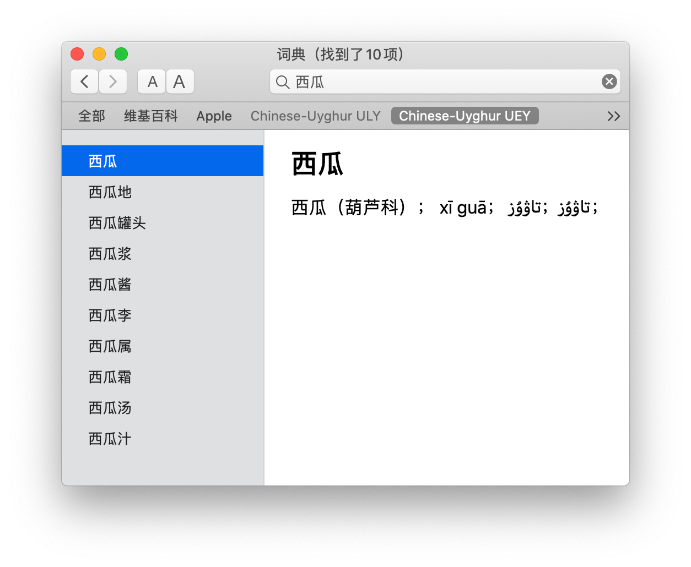

# Anatilim Uyghur ↔︎ Chinese Dictionary for macOS

Dictionaries are from [https://sites.google.com/site/anatilim/](https://sites.google.com/site/anatilim/).

[Download](https://github.com/xhacker/chinese-uyghur/releases)

## Install

Decompress and move `.dictionary` files to `/Library/Dictionaries`.

## Build

Using Chinese-Uyghur ULY as an example.

0. `pip3 install -r requirements.txt`
0. `./generate.py raw/ChineseUyghurStarDict_CnUy_ULY.txt chinese-uyghur-uly/MyDictionary.xml`
0. Put Dictionary Development Kit somewhere, and modify path in `chinese-uyghur-uly/Makefile`
0. `cd` into `chinese-uyghur-uly` folder, `make`
